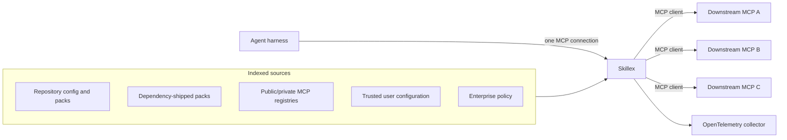
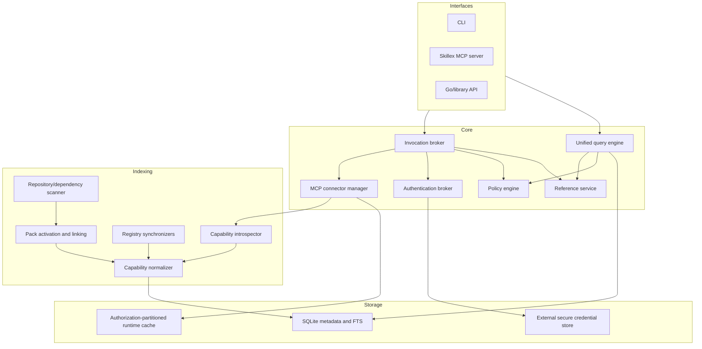
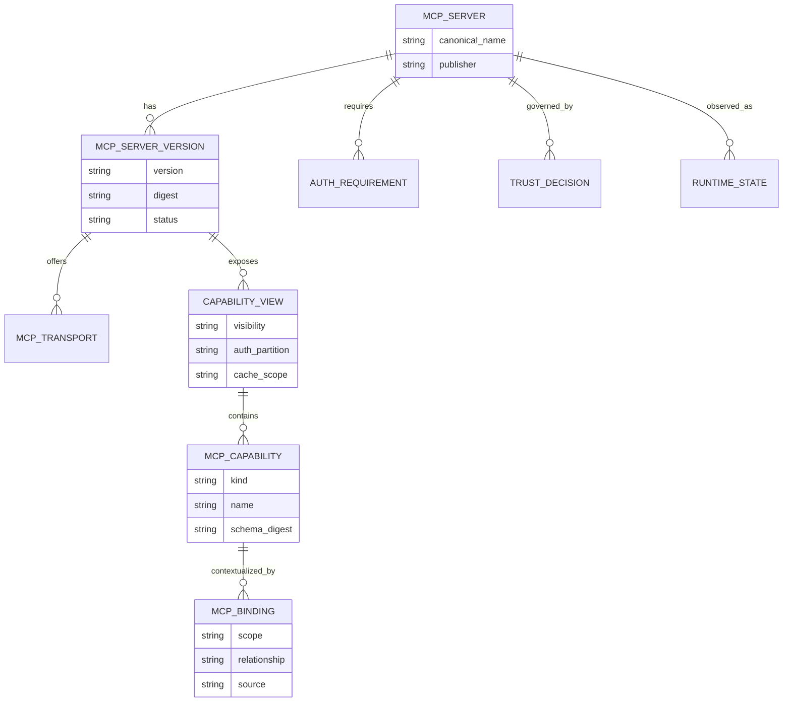
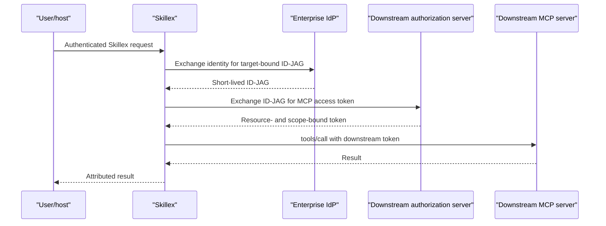
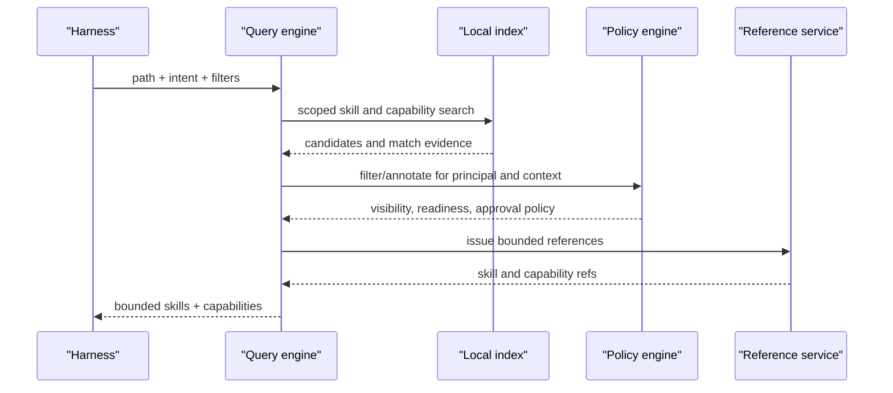
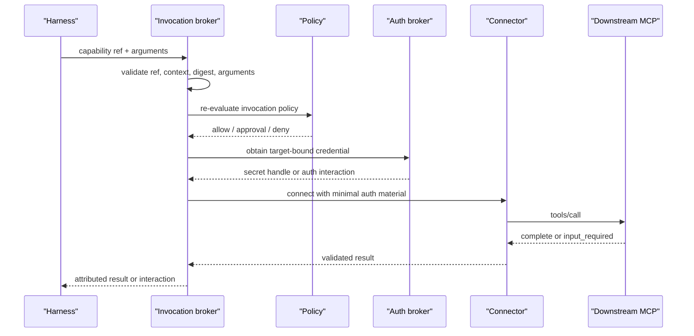
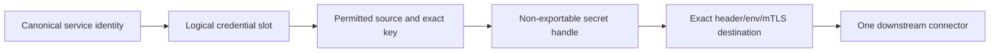

# High-Level Architecture: Contextual MCP Capability Broker

Status: proposed

Last updated: 2026-08-19

## Architecture summary

Skillex becomes a contextual knowledge and capability engine. Agent harnesses
connect only to Skillex. Skillex resolves relevant skills and MCP capabilities
from a local index and invokes selected downstream MCP servers as an MCP client.



The host-facing MCP surface remains small and stable:

```text
skillex_query
skillex_read
skillex_mcp_describe
skillex_mcp_call
```

Downstream servers are never registered with the harness. They do not appear in
host configuration and do not require host restart or refresh.

## Current architecture fit

The current repository separates:

- scanning in `internal/scanner/`;
- scope and visibility linking in `internal/linker/`;
- indexing and migrations in `internal/registry/`;
- bounded retrieval in `internal/query/`;
- CLI integration in `cli/`;
- MCP integration in `mcp/`;
- pack parsing and activation in `internal/packs/`.

The proposed architecture preserves those boundaries. MCP capabilities become a
parallel indexed domain, while query and invocation share policy, identity, and
reference contracts across CLI and MCP interfaces.

## System context and responsibilities

### Agent harness

The harness:

- registers and authenticates to Skillex;
- supplies query context such as path and intent;
- lets the model choose whether to query, read, describe, or call;
- presents user input and approval interactions;
- displays the real downstream server and capability identified by Skillex.

The harness does not:

- discover or register downstream MCP servers;
- hold downstream configuration generated by Skillex;
- list downstream tools directly;
- select downstream credentials;
- route downstream MCP requests.

### Skillex engine

The engine:

- ingests server catalogs and contextual bindings;
- indexes capability metadata;
- resolves path, dependency, version, policy, and readiness;
- returns bounded knowledge and capability results;
- validates selected references and arguments;
- resolves user or workload identity;
- obtains narrowly scoped downstream credentials;
- connects to and invokes downstream servers;
- propagates structured results, approvals, and failures;
- emits privacy-preserving telemetry.

### Downstream MCP server

The downstream server remains authoritative for:

- its protocol capabilities and concrete tool definitions;
- resource authorization and scope enforcement;
- actual tool behavior;
- result correctness;
- its own server-side auditing.

Skillex does not turn indexed metadata into an authorization guarantee.

## Logical components



### Source adapters

Source adapters ingest metadata without coupling query behavior to a particular
registry or package ecosystem:

- project configuration adapter;
- project-local pack adapter;
- Node and Go dependency pack adapters;
- standard MCP Registry API synchronizer;
- private registry synchronizer;
- trusted static configuration adapter;
- publisher capability metadata adapter;
- runtime observation adapter.

All ingested records retain source, signer or publisher, trust state, timestamps,
and the original source identity.

### Capability normalizer

The normalizer converts different inputs into canonical records:

- server identity and version;
- transport/install variants;
- capability kind and name;
- searchable text fields;
- compact schema summaries;
- raw definitions and schema digests;
- authorization requirements;
- public/private capability view;
- annotations and derived risk classification;
- cache and freshness metadata.

Declared and observed facts remain distinguishable. An observed `tools/list`
definition does not overwrite its publisher declaration without retaining both
provenances.

### Unified query engine

The query engine intersects:

- existing skill scope and visibility;
- MCP binding activation and scope;
- search terms and structured filters;
- server/capability trust;
- principal and enterprise policy;
- authorization view visibility;
- current readiness overlay.

Skills and capabilities may be ranked independently in the first compatible
response version. The engine returns bounded result sets, stable references,
match evidence, pagination, and candidate-scoped narrowing.

### Reference service

Skill references remain content addresses under the existing contract.
Invokable capability references are stronger. They bind:

- canonical server identity and version;
- capability name and schema digest;
- capability-view identifier;
- repository/context fingerprint;
- issue and expiration times;
- integrity signature.

A reference identifies a candidate; it does not grant authorization. Invocation
always re-evaluates trust, policy, schema freshness, readiness, and credentials.

### Policy engine

The policy engine evaluates layered facts:

```text
enterprise deny/require
    > user deny/allow
        > repository binding
            > package suggestion
```

Policy can return:

- hidden: omit from results;
- visible but unavailable: return with reason;
- callable without additional approval;
- callable with user approval;
- denied.

Policy decisions include machine-readable reason codes and provenance for audit.

### Authentication broker

The authentication broker has two distinct roles:

- inbound authenticators verify callers of hosted Skillex and produce a
  principal;
- outbound providers obtain target-bound credentials for downstream servers.

Common protocol primitives may be shared, but inbound tokens and downstream
tokens are not interchangeable.

Outbound providers include static secret resolution, OAuth, Enterprise-Managed
Authorization/ID-JAG, client credentials, workload identity, mTLS, and credential
helpers. Provider selection is constrained by canonical service configuration
and policy.

### Connector manager

The connector manager:

- supports stdio and Streamable HTTP;
- starts local servers only after trust and invocation;
- builds a minimal process environment;
- applies endpoint, sandbox, and network policy;
- negotiates supported MCP protocol versions;
- introspects capabilities;
- pools or reuses safe connections where applicable;
- applies timeouts, cancellation, retry, and circuit breaking;
- partitions caches by authorization context;
- shuts down idle local processes.

### Invocation broker

The broker is the only path from a capability reference to downstream execution.
It coordinates reference validation, policy, auth, connector selection, schema
validation, approval, downstream calls, output validation, and telemetry.

It always identifies the real downstream server and tool to the harness. The
generic Skillex tool name must not obscure the actual operation.

## Data model overview



Secret values and access tokens are deliberately absent. The database may store
credential profile identifiers and status, never credentials.

## Principal and identity model

Every hosted invocation has a principal:

```text
principal type: user | workload | service
issuer
subject
tenant
groups/roles
authentication strength/context
```

Local mode may derive a local principal from the OS user and selected Skillex
profile. That local principal is not automatically a federated identity; an
outbound provider must still obtain a downstream resource credential.

For Enterprise-Managed Authorization:



An ID-JAG is a grant consumed by the downstream authorization server, not a
general bearer token forwarded unchanged to the resource server.

## Core flows

### Refresh and synchronization flow

```text
1. Scan repository facts, configuration, dependencies, and packs.
2. Synchronize configured public/private registry deltas.
3. Parse server suggestions and trusted declarations.
4. Resolve activation rules and scopes.
5. Import publisher capability metadata without executing packages.
6. Optionally introspect already trusted/configured servers.
7. Normalize records and retain provenance.
8. Rebuild or incrementally update SQLite and FTS indexes transactionally.
9. Compute an index signature for staleness checks.
```

Refresh may use the network when explicitly configured. Query does not.

### Query flow



The query may check whether a specifically configured credential source is
present, but it reads only that exact configured source/key and never connects to
the downstream service.

### Invocation flow



### Missing-auth flow

If the capability is relevant but authentication is absent:

1. Query returns the capability with `login-required`, `credential-missing`, or
   another precise status.
2. Invocation may return a standards-compatible input requirement describing the
   target service, requested scopes, and login action.
3. The user completes login through the configured provider.
4. The original invocation resumes or is retried with the same selected
   capability after all context and policy checks are repeated.

Discovery alone never launches an interactive login for every candidate.

## Capability indexing strategy

### Search documents

Each capability produces a compact search document containing:

- tool/prompt/resource name and title;
- description;
- argument names and descriptions;
- output summary;
- server name and description;
- pack-provided topics, tags, and intended uses;
- derived read/write/destructive classification;
- contextual binding text.

Raw JSON Schemas remain in a separate record and are loaded only for describe,
argument validation, and invocation.

### Ranking

Initial ranking should weight:

1. exact capability name/title matches;
2. capability description matches;
3. argument name/description matches;
4. explicit contextual binding and preferred capability matches;
5. server description and instructions;
6. readiness and trust as bounded boosts, not substitutes for relevance.

Unavailable capabilities may remain visible with an explanation. Policy-hidden
capabilities are omitted.

### Authorization partitions

Public and private capability views are distinct. Private results and cache
entries are keyed by at least tenant, principal or credential profile, server,
and authorization issuer. A private view must never leak tool names or schemas to
another authorization context.

## Trust model

### Trust levels

```text
public registry metadata       -> discovered, untrusted
dependency pack declaration    -> suggested, untrusted
project-local declaration      -> contextually relevant, not credential-trusted
user-approved identity/version -> trusted for that user
enterprise allow policy        -> trusted within policy constraints
observed runtime definition    -> verified as observed, behavior still untrusted
```

### Identity binding

A trust decision is bound to:

- canonical registry name;
- publisher namespace or signer;
- version and package digest where available;
- transport type;
- remote origin or local package identifier;
- optional executable digest;
- allowed capabilities and risk policy.

Changing those facts invalidates or narrows trust.

### Credential confinement



The project may select a trusted profile only under policy. It cannot construct a
new path from an arbitrary secret to an arbitrary server.

Project activation is also an explicit boundary: version 4 configuration is
skills-only, and version 5 constructs the broker only when `MCP.Enabled` is true
and at least one exact server-version binding is present. The gate is evaluated
before catalog, credential, policy, or connector dependencies are initialized.

## Deployment modes

### Local open source

- Skillex runs over stdio as today.
- SQLite and search remain local.
- Credentials come from exact local sources, OS keychain, or corporate helpers.
- Downstream stdio and HTTP connections originate locally.
- Telemetry defaults to local/off unless explicitly exported.

### Hosted multi-tenant

- Harnesses connect to a remote Skillex MCP endpoint.
- Inbound OAuth or enterprise identity produces tenant-scoped principals.
- Public and private catalogs are synchronized centrally.
- Private capability views, policies, caches, tokens, and telemetry are strongly
  tenant-partitioned.
- Downstream calls originate from the hosted service, subject to enterprise
  egress and data-residency policy.

### Enterprise self-hosted

- Same open protocols and schemas as hosted mode.
- Customer controls network, identity provider, registry sources, credential
  providers, policy, storage, and telemetry export.
- No dependency on the managed Skillex service is required.

### Hybrid

- Local Skillex performs repository scanning and local stdio invocation.
- A hosted service supplies signed catalog snapshots, enterprise policy, and
  identity/token exchange.
- Sensitive local resources remain local while shared governance remains
  centralized.

## Open source and hosted boundary

Open source must include:

- source and pack schemas;
- local catalog/index formats and migrations;
- query, describe, and invocation contracts;
- reference encoding and validation;
- policy model and evaluator;
- auth provider and secret-source interfaces;
- stdio and HTTP connector interfaces;
- telemetry event schema;
- fake servers/providers and conformance tests;
- local implementations sufficient for useful end-to-end operation.

Hosted value may include:

- managed registry synchronization;
- managed multi-tenant storage and availability;
- enterprise IdP integrations;
- managed key storage and rotation;
- organization policy administration;
- shared private capability indexing;
- dashboards, alerting, and usage analytics;
- managed regional egress and compliance controls.

Hosted implementation must not redefine the portable contracts in incompatible
ways.

## Protocol and ecosystem alignment

The design targets MCP revision `2026-07-28` as of this document date.

- `server/discover` supplies supported versions and capability families after an
  endpoint is known; it is not a server catalog.
- `tools/list`, `prompts/list`, and resource list operations supply concrete
  capability metadata.
- list responses carry TTL and cache-scope hints.
- tool lists may change over time and support list-change subscriptions.
- Streamable HTTP method and tool headers make gateway routing and metering
  possible without parsing request bodies.
- Enterprise-Managed Authorization is a stable extension; Client Credentials is
  currently a draft extension.
- structured observability should use OpenTelemetry rather than the deprecated
  MCP logging capability.

Authoritative references:

- [MCP 2026-07-28 release](https://blog.modelcontextprotocol.io/posts/2026-07-28/)
- [MCP 2026-07-28 specification](https://modelcontextprotocol.io/specification/2026-07-28)
- [MCP tools](https://modelcontextprotocol.io/specification/2026-07-28/server/tools)
- [MCP authorization](https://modelcontextprotocol.io/specification/2026-07-28/basic/authorization)
- [MCP specification sources](https://github.com/modelcontextprotocol/modelcontextprotocol/tree/main/docs/specification/2026-07-28)
- [MCP Registry API](https://github.com/modelcontextprotocol/registry/blob/main/docs/reference/api/openapi.yaml)
- [Registry aggregators and subregistries](https://github.com/modelcontextprotocol/registry/blob/main/docs/modelcontextprotocol-io/registry-aggregators.mdx)
- [Enterprise-Managed Authorization](https://github.com/modelcontextprotocol/ext-auth/blob/main/specification/stable/enterprise-managed-authorization.mdx)
- [OAuth Client Credentials draft](https://github.com/modelcontextprotocol/ext-auth/blob/main/specification/draft/oauth-client-credentials.mdx)

## Failure isolation

- A registry outage affects synchronization, not local queries.
- A downstream server outage affects only that server's capabilities.
- An auth provider outage produces a scoped auth failure, not an index failure.
- An invalid pack entry is reported without enabling the server or credential.
- A stale schema invalidates the selected reference and requests a new query.
- A telemetry exporter failure must not fail an invocation unless enterprise
  fail-closed audit policy explicitly requires it.
- A local child-process crash is contained by the connector manager and may trip
  a per-server circuit breaker.

## Architectural decisions

### AD1: Skillex brokers calls; it does not register downstream servers

This is the defining product boundary and the source of harness independence.

### AD2: Capabilities, not servers, are the primary action search unit

Server descriptions remain useful for catalog discovery and provenance, but tool
and template metadata drive task search.

### AD3: Query remains local and bounded

Network discovery during a prompt would make latency and reliability depend on
every registry and server. Explicit synchronization and cached introspection keep
query deterministic.

### AD4: Capability references are not authorization grants

References are integrity-protected selectors. Policy, auth, schema, and context
are re-evaluated at call time.

### AD5: Trusted credential mapping is separate from code-shipped suggestions

This prevents a malicious repository or dependency from redirecting ambient
secrets to an attacker-controlled MCP server.

### AD6: Auth is pluggable on both sides of hosted Skillex

Inbound authentication and outbound authorization use different interfaces even
when they share OAuth and token-validation primitives.

### AD7: The open source engine defines the portable behavior

The hosted service is an operational and enterprise offering, not a proprietary
replacement for local resolution and invocation.
